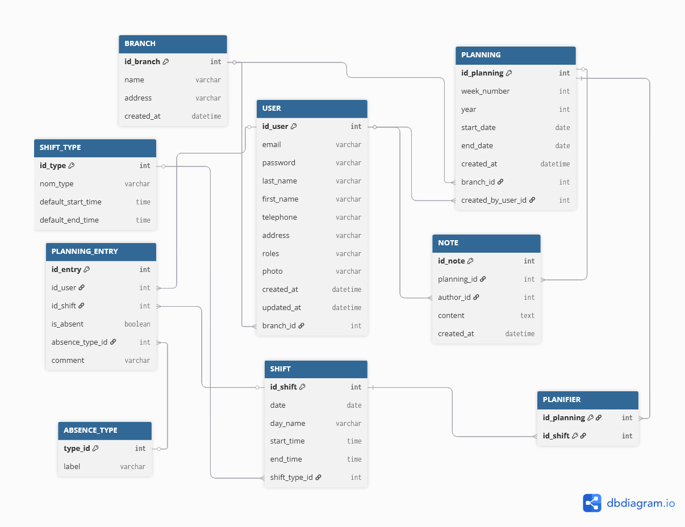

# 📊 Application de gestion des plannings

Cette application permet aux managers et employés d’organiser les plannings, suivre les présences et échanger des messages internes.  
Elle est conçue pour les équipes réparties par branches, avec une base de données relationnelle optimisée.

## 📁 Diagramme de la base de données

